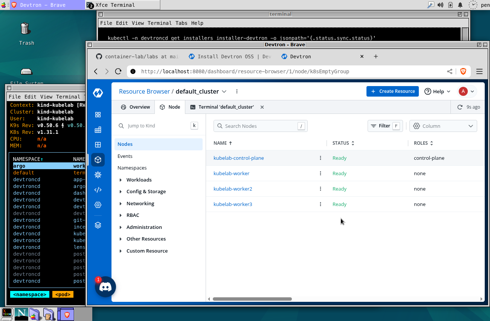

# Devtron
[Devtron](https://devtron.ai/) is purpose-built for production Kubernetes teams, unifying app and infrastructure management with an AI teammate that simplifies operations and speeds delivery.

- [Devtron GitHub](https://github.com/devtron-labs)
- [User Guide: Install Devtron OSS](https://docs.devtron.ai/install/devtron-oss)


## Quick Start
For quickstart, run bootstrap script:
```
bash up.sh
```

After installation, get an initial admin password, then, open localhost:8000 to access Devtron through port forwarding and login as admin with the initial password:
```
kubectl --namespace devtroncd get secret devtron-secret -o jsonpath='{.data.ADMIN_PASSWORD}' | base64 -d ; echo
kubectl --namespace devtroncd port-forward service/devtron-service 8000:80
```

Clean up:
```
bash clean.sh
```



## Application Management
Go to the navigation and select *Appliactions* to move application page. Select *Create > From Chart store* menu at the top of the screen to create a new application. And follow the instructions to install *nginx-ingress* example to your Kubernetes cluster.


