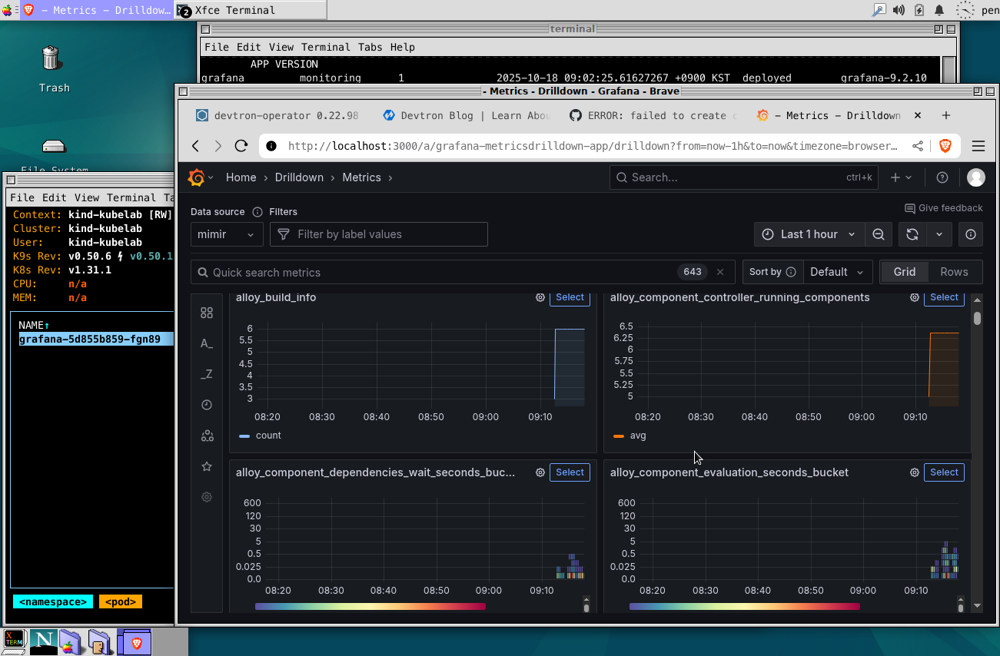
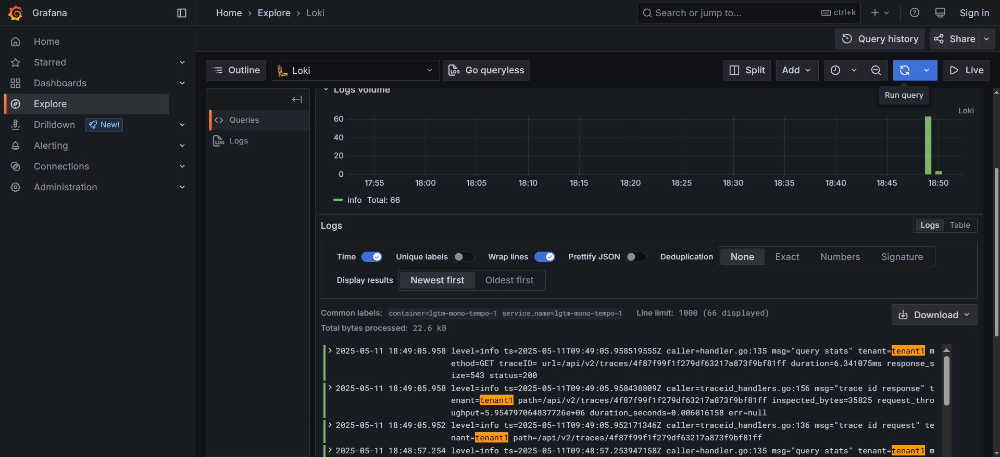
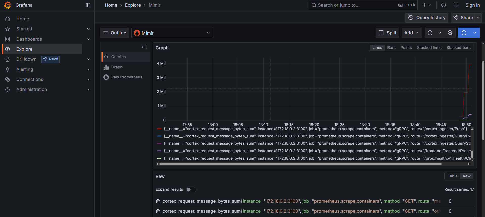
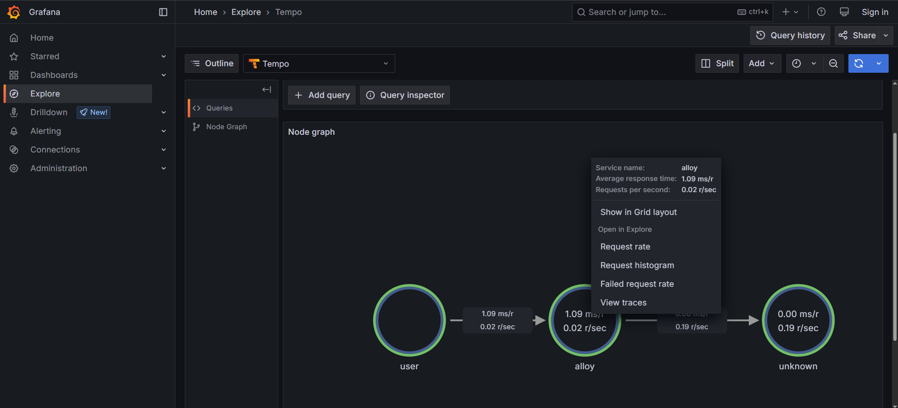

# Deployment mode: Distributed
For quickstart, run bootstrap script in the *distributed* directory:
```
bash up.sh
```

Clean up:
```
bash clean.sh
```

You may see `htpasswd: command not found error` error if you don't have it in your system. To fix, you need to intall *htpasswd*. It is required to generate a htpasswd file for basic auth of Apache or Nginx server.

Debian/Ubuntu:
```
sudo apt update && sudo apt install apache2-utils
```

You need to install helm diff plugin if you see `Error: unknown command "diff" for "helm"` message:
```
helm plugin install https://github.com/databus23/helm-diff
```

Loki requires at least 3 Kubernetes nodes to deploy an ingester per node. This is necessary for pod-affinity.

# Deployment mode: Monolithic
For quickstart, run docker compose in the *monolithic* directory:
```
docker compose up -d
```

Clean up:
```
docker compose down
```

# Grafana






# Additional Resources
- [Introduction to Metrics, Logs, Traces, and Profiles (MLTP) in Grafana](https://github.com/grafana/intro-to-mltp)

