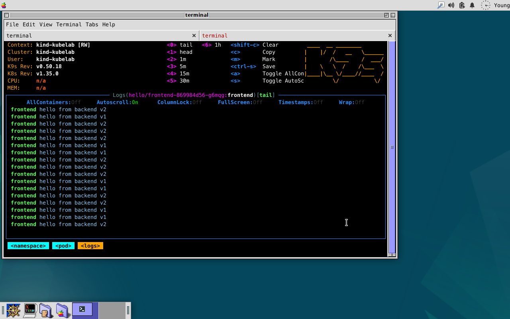
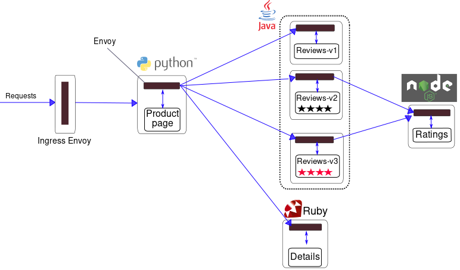

# Istio
[Istio](https://istio.io) is an open source service mesh that layers transparently onto existing distributed applications. Istio's powerful features provide a uniform way to integrate microservices, manage traffic flow across microservices, enforce policies and aggregate telemetry data. Istio's control plane provides an abstraction layer over the underlying cluster management platform, such as Kubernetes.

Istio is composed of these components:

- **Envoy** - Sidecar proxies per microservice to handle ingress/egress traffic between services in the cluster and from a service to external services. The proxies form a secure microservice mesh providing a rich set of functions like discovery, rich layer-7 routing, circuit breakers, policy enforcement and telemetry recording/reporting functions.
- **Ztunnel** - A lightweight data plane proxy written in Rust, used in Ambient mesh mode to provide secure connectivity and observability for workloads without sidecar proxies.
- **Istiod** - The Istio control plane. It provides service discovery, configuration and certificate management.

## Quick Start
The testing environment:
- Istio Helm Chart 1.29
- Helm 3.18.1
- Kubernetes 1.35.0
- (Optional) Istioctl 1.29
- 4GB+ RAM

> [!NOTE]
> If you enable telemetry / logging / tracing, Memory/CPU overhead will increase.

> [!CAUTION]
> There is an issue in automatic sidecar injection via Mutating Webhook Admission on Minikube

You can install Istio with one of the popular opstions - Helm, Istioctl
- [Install Istio with Helm](https://istio.io/latest/docs/setup/install/helm/)
- [Install Istio using Istioctl](https://istio.io/latest/docs/setup/getting-started/)

### Install with Helm
Run your Kubernetes cluster using [kind](../kind/kind.md), or your preferred provider. When your Kubernetes is ready, run the bootstrap script for quickstart. This script setup up prerequisites and install Istio using Helm, a popular package manager for Kubernetes distributed applications.

```sh
bash up.sh
```

If no issues, you will see proper pods in the istio-system namespace.
```sh
kubectl -n istio-system get po
NAME                    READY   STATUS    RESTARTS   AGE
istiod-868857f6-6h69v   1/1     Running   0          53s
```

## Examples

### Hello
This is an example demonstraing application-level traffic control with simple web application returning server version. You can see how to configure virtual servers and destination rules managed by istio. Run the following command to deploy resources.
```sh
kubectl apply -f apps/hello/app.yaml
kubectl apply -f apps/hello/istioroute.yaml
```

The logs show that the backend server version is constantly changing due to weight-based routing.
```sh
kubectl -n hello logs -f -l app=frontend
```



After testing, you'd better to remove the example to prevent orphaned resources.
```sh
kubectl delete -f apps/hello/istioroute.yaml
kubectl delete -f apps/hello/app.yaml
```

### Bookinfo
This is an service mesh example, application traffic management without application changes, displays information about a book, similar to a single catalog entry of an online book store. Displayed on the page is a description of the book, book details (ISBN, number of pages, and so on), and a few book reviews.

#### Application
Deploy the bookinfo microservices application.
```sh
kubectl apply -n bookinfo -f apps/bookinfo/app.yaml
```

> [!NOTE]
> The `apps/bookinfo/app.yaml` is a copy from the original repo. You can download and install the example directly from the github repo.
> ```sh
> kubectl apply -n bookinfo -f https://raw.githubusercontent.com/istio/istio/release-1.29/samples/bookinfo/platform/kube/bookinfo.yaml
> ```
>
> **Don't forget** you should use the same manifest file when you remove the application if you installed it with the remote file.
> ```sh
> kubectl delete -n bookinfo -f https://raw.githubusercontent.com/istio/istio/release-1.29/samples/bookinfo/platform/kube/bookinfo.yaml
> ```

The application is broken into four separate microservices:
- *productpage*: The productpage microservice calls the details and reviews microservices to populate the page.
- *details*: The details microservice contains book information.
- *reviews*: The reviews microservice contains book reviews. It also calls the ratings microservice.
- *ratings*: The ratings microservice contains book ranking information that accompanies a book review.

There are 3 versions of the reviews microservice:
- Version v1 doesn’t call the ratings service.
- Version v2 calls the ratings service, and displays each rating as 1 to 5 black stars.
- Version v3 calls the ratings service, and displays each rating as 1 to 5 red stars.

You will see the services.
```sh
kubectl -n bookinfo get services
```

You can access productpage service via port forwarding to your local Kubernetes. Run the following command and open `http://localhost:9080` on your browser. If you deployed the application to your preferred provider like an EKS, you can access the service on a LoadBalancer that it is provided by cloud service.
```sh
kubectl -n bookinfo port-forward service/productpage 9080:9080
```

#### Gateway
Along with support for Kubernetes Ingress resources, Istio also allows you to configure ingress traffic using either an Istio Gateway or Kubernetes Gateway resource. A **Ingress Gateway** is to manage *inbound* and *outbound* traffic for your mesh, letting you specify which traffic you want to enter or leave the mesh. Gateway configurations are applied to standalone Envoy proxies that are running at the edge of the mesh, rather than sidecar Envoy proxies running alongside your service workloads.

#### Istio Gateway
Unlike other mechanisms for controlling traffic entering your systems, such as the Kubernetes Ingress APIs, Istio gateways let you use the full power and flexibility of Istio’s traffic routing. You can do this because Istio’s Gateway resource just lets you configure layer 4-6 load balancing properties such as ports to expose, TLS settings, and so on. Then instead of adding application-layer traffic routing (L7) to the same API resource, you bind a regular Istio virtual service to the gateway. This lets you basically manage gateway traffic like any other data plane traffic in an Istio mesh.

You can see Istio `istio-ingressgateway` and `istio-egressgateway` services and pods in your `istio-system` namespace, if you installed the all optional helm charts described in the setup script.
```sh
kubectl -n istio-system get services
```

If everything looks good, apply the Istio Gateway configurations on the bookinfo application.
```sh
kubectl apply -n bookinfo -f apps/bookinfo/istiogw.yaml
```

The end-to-end architecture of the application is shown below.



> [!NOTE]
> For more information and updates, please chcekout the official guide of [Bookinfo Application](https://istio.io/latest/docs/examples/bookinfo/) or github repository for [Bookinfo Source Code](https://github.com/istio/istio/tree/master/samples/bookinfo).

Same as the other examples, clean up the applications when you finished the lab.
```sh
kubectl delete -n bookinfo -f apps/bookinfo/istiogw.yaml
kubectl delete -n bookinfo -f apps/bookinfo/app.yaml
```

## Clean up
Before you uninstall istio resrouces from your kubernetes, don't forget to remove the examples. If you installed Istio using Helm and bootstrap script, run the command to uninstall helm release and clean up resources.
```sh
bash clean.sh
```

## Troubleshooting

# Additional Resources
- [Istio GitHub](https://github.com/istio/istio)
- [Istio Hands-on](https://vigneshragupathy.com/istio-hands-on-part-1-from-kubernetes-to-service-mesh/)
