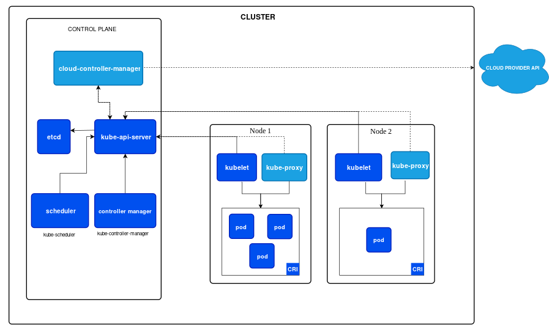
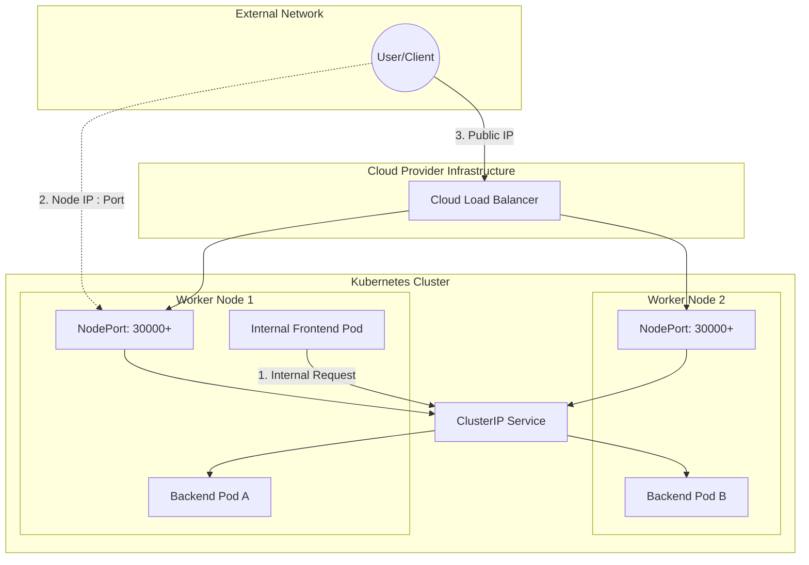

# Network Engineering Lab

## Table of Contents
- [Kubernetes Networking](#kubernetes-networking)

## Kubernetes Networking
[Kubernetes](../README.md#kubernetes) is a platform that automates the deployment, scaling, and management of containerized applications. To understand how Kubernetes ensures containers run efficiently and reliably across a cluster of machines, we need to know components of Kubernetes and how they communcate.



### Components

#### Pod

#### Service
Kubernetes services define how to expose applications running on pods, with 3 main types: **ClusterIP** (internal), **NodePort** (external port), and **LoadBalancer** (cloud provider load balancer). These types determine network accessibility, with ClusterIP as default and LoadBalancer typically used for public-facing production apps. 

Here is a breakdown of the Kubernetes service types:

- **ClusterIP (Default)**
  - The default type, providing a stable internal IP address reachable only within the cluster for internal load balancing. It acts as an internal load balancer, balancing traffic across backend pods.
  - Use Case: Internal microservices communication (e.g., frontend-to-backend), database connections, or components that should not be exposed to the public internet.

- **NodePort**
  - A service type, exposing the service on a specific port (usually 30000–32767) on every node's IP to allow traffic form outside the cluster via `<NodeIP>:<NodePort>`. It also automatically creates a ClusterIP, to which it routes, so when a traffic is received on the node, then forwarded to the service's ClusterIP.
  - Use Case: Development, testing, scenarios requiring direct Node access without a cloud load balancer, or small-scale apps needing quick external access (not recommended in production).

- **LoadBalancer**
  - A recommended service type for external-facing service leveraging cloud provider load balancers (Layer 4). It automatically creates a NodePort and a ClusterIP, serving as an extension of both, to route traffic directly to pods.
  - Use Case: Production applications needing high availability and automatic, public/internet-facing load balancing.

This is the diagram shows traffic flow of Kubernetes service types:


Other service types:
- **ExternalName**
  - A service type acts as a DNS alias (CNAME record) that maps an internal Kubernetes service name to a DNS name outside the cluster (e.g., *mydb.example.com*). It allows pods to use a local service name for an external service (an external database or API). Unlike other service types, it does not use selectors or proxy traffic; it purely handles redirection at the DNS level.
  - Use Case: Accessing external services, keeping database or other references while migration

- **Headless Service**
  - A type of ClusterIP that skips assigning a single stable IP, instead returning the IP addresses of all backend pods via DNS.
  - Use Case: Stateful applications (e.g., databases) needing direct, client-side load balancing or pod-to-pod discovery without load balancing. Useful for databases or StatefulSets. 


This is an example output of listing Kubernetes services using `kubectl get svc` command:
```sh
NAME             TYPE           CLUSTER-IP      EXTERNAL-IP     PORT(S)          AGE
backend-svc      ClusterIP      10.96.100.10    <none>          80/TCP           10m
web-nodeport     NodePort       10.96.100.20    <none>          80:31234/TCP     5m
frontend-lb      LoadBalancer   10.96.100.30    35.190.24.12    80:30555/TCP     2m
external-db      ExternalName   <none>          db.example.com  <none>           1m
```

The key differences are:
| Type | CLUSTER-IP | EXTERNAL-IP | PORT(S)  |
|------|------------|-------------|----------|
| ClusterIP | Displays an internal IP accessible only within the cluster | Always `<none>` | Shows the service port (e.g., `80/TCP`) |
| NodePort | Has an internal IP | | Displays a mapping of the internal port to the node's static port (e.g., `80:31234/TCP`). The port in the 30000-32767 range is the external entry point |
| LoadBalancer | Shows the public IP or DNS name provided by the cloud vendor. If it says `<pending>`, the cloud provider is still provisioning the load balancer | | Shows both the service port and the automatically created NodePort (e.g., `80:30555/TCP`) |
| ExternalName | Always <none> as no proxying is involved | Displays the external DNS alias (e.g., db.example.com) | Usually <none> because it relies on external DNS |

#### DNS
Cluster DNS is a DNS server, in addition to the other DNS server(s) in your environment, which serves DNS records for Kubernetes services. Containers started by Kubernetes automatically include this DNS server in their DNS searches

#### Ingress
While not a "service type" itself, Ingress is an API object that acts as a smart router (HTTP/HTTPS) in front of ClusterIP services, often providing cost-effective traffic management, such as TLS termination.

# Additional Resources
## Kubernetes Networking
- [Cluster Networking | Kubernetes](https://kubernetes.io/docs/concepts/cluster-administration/networking/)
- [Services, Load Balancing, and Networking | Kubernetes](https://kubernetes.io/docs/concepts/services-networking/)
- [Connecting Applications with Services | Kubernetes](https://kubernetes.io/docs/tutorials/services/connect-applications-service/)
- [Enhancing DevOps Efficiency on Amazon EKS with Devtron](https://aws.amazon.com/blogs/apn/enhancing-devops-efficiency-on-amazon-eks-with-devtron/)

