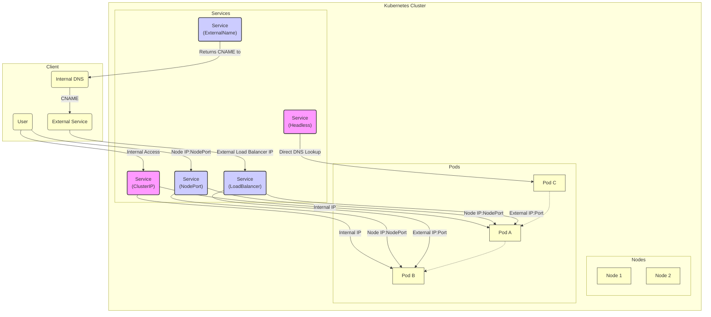

# Network Engineering Lab

## Table of Contents
- [Kubernetes Networking](#kubernetes-networking)

## Kubernetes Networking
[Kubernetes](../README.md#kubernetes) is a platform that automates the deployment, scaling, and management of containerized applications. To understand how Kubernetes ensures containers run efficiently and reliably across a cluster of machines, we need to know components of Kubernetes and how they communcate.

### Components

#### Pod

#### Service
Kubernetes services define how to expose applications running on pods, with 3 main types: **ClusterIP** (internal), **NodePort** (external port), and **LoadBalancer** (cloud provider load balancer). These types determine network accessibility, with ClusterIP as default and LoadBalancer typically used for public-facing production apps. 

Here is a breakdown of the Kubernetes service types:

- **ClusterIP (Default)**
  - The default type, providing a stable internal IP address reachable only within the cluster for internal load balancing. It acts as an internal load balancer, balancing traffic across backend pods.
  - **Use Case:** Internal microservices communication (e.g., frontend-to-backend), database connections, or components that should not be exposed to the public internet.

- **NodePort**
  - A service type, exposing the service on a specific port (usually 30000–32767) on every node's IP to allow traffic form outside the cluster via `<NodeIP>:<NodePort>`. It also automatically creates a ClusterIP, to which it routes, so when a traffic is received on the node, then forwarded to the service's ClusterIP.
  - **Use Case:** Development, testing, scenarios requiring direct Node access without a cloud load balancer, or small-scale apps needing quick external access (not recommended in production).

- **LoadBalancer**
  - A recommended service type for external-facing service leveraging cloud provider load balancers (Layer 4). It automatically creates a NodePort and a ClusterIP, serving as an extension of both, to route traffic directly to pods.
  - **Use Case:** Production applications needing high availability and automatic, public/internet-facing load balancing.

Other service types:
- **ExternalName**
  - A service type, providing maps the a service to a DNS name using a CNAME record. This is commonly used to create a service within Kubernetes to represent an external DNS endpoint (e.g., an external database or API).
  - **Use Case:** Accessing external services (e.g., an external database) rather than pods or during application migration. 

- **Headless Service**
  - A type of ClusterIP that skips assigning a single stable IP, instead returning the IP addresses of all backend pods via DNS.
  - **Use Case:** Stateful applications (e.g., databases) needing direct, client-side load balancing or pod-to-pod discovery without load balancing. Useful for databases or StatefulSets. 

#### DNS
Cluster DNS is a DNS server, in addition to the other DNS server(s) in your environment, which serves DNS records for Kubernetes services. Containers started by Kubernetes automatically include this DNS server in their DNS searches

#### Ingress
While not a "service type" itself, Ingress is an API object that acts as a smart router (HTTP/HTTPS) in front of ClusterIP services, often providing cost-effective traffic management, such as TLS termination.

# Additional Resources
## Kubernetes Networking
- [Cluster Networking | Kubernetes](https://kubernetes.io/docs/concepts/cluster-administration/networking/)
- [Services, Load Balancing, and Networking | Kubernetes](https://kubernetes.io/docs/concepts/services-networking/)
- [Connecting Applications with Services | Kubernetes](https://kubernetes.io/docs/tutorials/services/connect-applications-service/)
- [Enhancing DevOps Efficiency on Amazon EKS with Devtron](https://aws.amazon.com/blogs/apn/enhancing-devops-efficiency-on-amazon-eks-with-devtron/)

