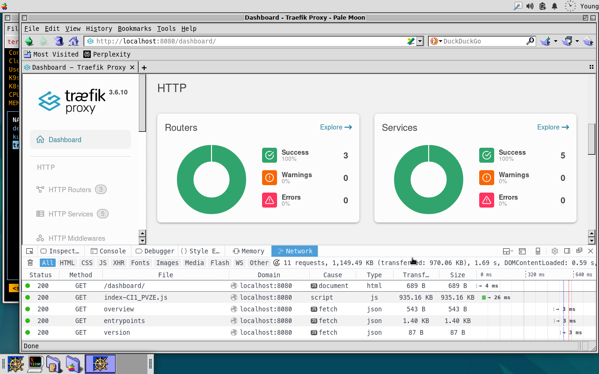

# Traefik

## Quick Start
The testing environment:
- Traefik Helm Chart 39.0.5
- Helm 3.18
- Kubernetes 1.35.0
- 4GB+ RAM

Run your Kubernetes cluster using [kind](../kind/kind.md), Minikube, or your preferred tool. When your Kubernetes is ready, run the bootstrap script for quickstart.
```sh
bash up.sh
```

If no issues, you will see traefik pod in traefik namespace.
```sh
kubectl get pods -n traefik
NAME                       READY   STATUS    RESTARTS   AGE
traefik-55548cc574-x7xhn   1/1     Running   0          24m
```

After traefik proxy install, you can access web dashboard via port forwarding. Run kubectl commend following or use `k9s` to enable port forwarding, and open localhost:8080 in your browser. By default, traefik listen on 8080 port for traefik management requests and expose the 8000 (web), 8443 (web-secure) ports for user traffic.

```sh
kubectl -n vault port-forward svc/traefik 8080
```



## Clean up
Before you uninstall traefik resrouces from your kubernetes, don't forget to remove the examples. To uninstall packages, run the command.
```sh
bash clean.sh
```

## Troubleshooting

# Additional Resources
- [Traefik](https://doc.traefik.io)

