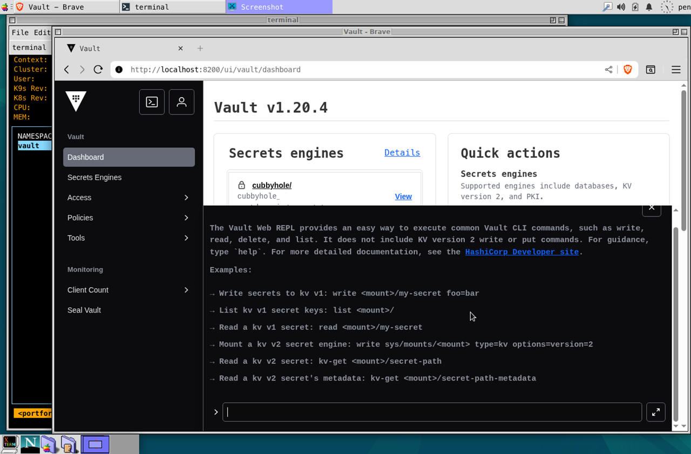
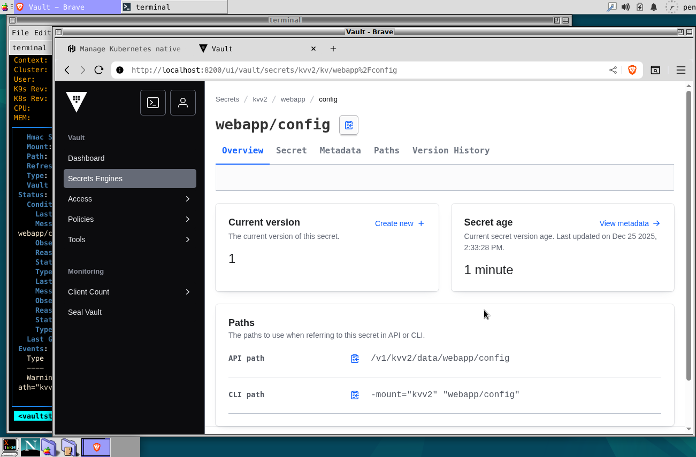

# HashiCorp Vault
[HashiCorp Vault](https://www.hashicorp.com/vault) is a tool for securely accessing secrets. A secret is anything that you want to tightly control access to, such as API keys, passwords, certificates, and more. Vault provides a unified interface to any secret, while providing tight access control and recording a detailed audit log.

- [HashiCorp Vault GitHub](https://github.com/hashicorp/vault)
- [Developer Guide: HashiCorp Vault](https://developer.hashicorp.com/vault)

## Quick Start
The versions required are:
- Helm 3.6+
- Kubernetes 1.29+

> [!TIP]
> Run a local Kubernetes cluster using [kind](../kind/kind.md) if you need
> ```bash
> kind create cluster --image kindest/node:v1.32.2
> ```

For quickstart, run bootstrap script:
```sh
bash up.sh
```

If no issues, you will see vault server pod in vault namespace.
```sh
kubectl get pods -n vault
NAME      READY   STATUS    RESTARTS   AGE
vault-0   1/1     Running   0          3m
```

> [!NOTE]
> In this example, the local vault server runs as a development mode, which means it is enabled auto-unseals, and in-memory storage for convinence. However, that is riscky for production environment.
> ```yaml
> server:
>  dev:
>    enabled: true
>    devRootToken: "root"
> ```
>
> For secure and reliable vault server operation, don't forget to disable `dev mode`. For more information, please check out the [HashiCorp Vault Deverloper Guide: Seal/Unseal](https://developer.hashicorp.com/vault/docs/concepts/seal).

After vault server and vault secrets operator install, you can access vault UI via port forwarding. Run kubectl commend following or use `k9s` to enable port forwarding, and open localhost:8200 in your browser:

```sh
kubectl -n vault port-forward svc/vault-ui 8200
```



### Vault Secrets
In the previous step, your vault server is enabled to mount the local Kubernetes. The next steps are; enabling KV v2 secret engin, apply secret access policy, create a demo secret in Vault, and create `VaultStaticSecret` for automatic sync of kubernetes and vault secrets. 
```sh
bash vaultkv.sh
```

Access vault server via Web Ui you can see a new secret on the kvv2/webapp path. And you can see kubernetes secret that is automatically managed by Vault Secrets Operator.




## Clean up
Before you uninstall vault and vault secrets operator resrouces from your kubernetes, make sure the demo secret resources are removed. Run command to uninstall packages:
```sh
bash clean.sh
```

## Troubleshooting

# Additional Resources
- [Manage Kubernetes native secrets with the Vault Secrets Operator](https://developer.hashicorp.com/vault/tutorials/kubernetes-introduction/vault-secrets-operator)
- [Vault Install Guide](https://developer.hashicorp.com/vault/install)

